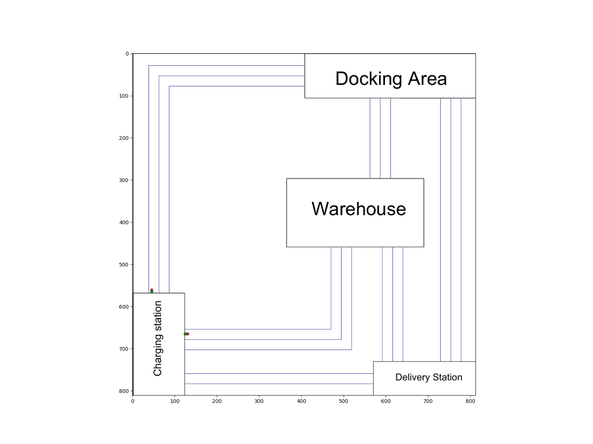

# ROBOT FLEET MANAGEMENT SYSTEM

Computer Programming Course Project

---

## PROJECT OVERVIEW

This project implements a Robot Fleet Management System that simulates how multiple autonomous robots can be coordinated to perform logistics tasks in a warehouse environment. The system demonstrates core computer programming concepts such as abstraction, object-oriented programming, modular design, and system modelling.

Robots are assigned tasks by a central controller (FleetAdmiral) and navigate through a predefined warehouse map using fixed routes. The robots’ movements are animated to visually represent task execution.

The project is implemented in Python, with a corresponding MATLAB version intended for cross-language comparison and validation.

---

## PROJECT OBJECTIVES

- Demonstrate abstraction and object-oriented programming concepts
- Model a real-world warehouse logistics system
- Coordinate multiple robots using a centralized controller
- Visualize robot movement using animation
- Implement the same system logic in Python and MATLAB

---

## KEY PROGRAMMING CONCEPTS USED

1. Abstraction

   - Each class has a single, well-defined responsibility
   - Robots do not manage tasks directly
   - Tasks do not control robots or maps

2. Object-Oriented Programming

   - Classes: Task, Robot, Map, FleetAdmiral, Alert
   - Encapsulation of robot state, task state, and system logic

3. Modular Design

   - Each component is implemented in a separate file
   - Clear separation between control logic, animation, and data models

4. System Modelling

   - Warehouse environment represented as predefined routes
   - Centralized task scheduling and robot coordination

---

## SYSTEM ARCHITECTURE

Main Components:

- Task
  Represents a logistics job with an ID, description, source location, destination, priority, and status.

- Robot
  Represents an autonomous robot that executes a task by moving along a planned route at a speed determined by task priority.

- Map
  Represents the warehouse environment and handles visualization and animation of robot movement.

- FleetAdmiral
  Acts as the central controller responsible for accepting tasks, assigning them to robots, and monitoring execution.

- Alert
  An abstract base class defining the alerting mechanism used to notify the user of system events.

---

### DIRECTORY STRUCTURE

abdulqadirmuazzim-robot_fleet_management_system/

Alert.py - Abstract alert interface
Task.py - Task definition and status handling
Robot.py - Robot logic and route planning
Maps.py - Warehouse map, routes, and animation
app.py - Main application and system controller

---

### TASK LOCATIONS

The system uses coded identifiers for warehouse locations:

- CS : Charging Station
- DA : Docking Area
- WH : Warehouse
- DS : Delivery Station

Robots move between these locations using predefined routes.

---

### HOW THE SYSTEM WORKS

1. The user defines a list of tasks.
2. The FleetAdmiral accepts the tasks into the system.
3. Each task is assigned to a robot.
4. Robots plan routes based on task locations.
5. Robots move along the routes on the warehouse map.
6. Task status is updated during execution.
7. The animation visualizes all robots simultaneously.

---

### HOW TO RUN THE PROJECT (PYTHON)

1. run
    ```bash
    pip install -r requirements.txt
    ```

2. Run the application
    ```bash
    python app.py
    ```

An animated window will open showing robots executing tasks on the warehouse map.




---

### OUTPUT

- Animated visualization of robot fleet movement
- Console alerts indicating task assignment and completion
- Task status tracking through the FleetAdmiral

---

### ACADEMIC NOTE

This project was developed strictly for academic purposes as part of a Computer Programming course. The focus is on software design principles, system modelling, and programming concepts rather than real-world deployment.
